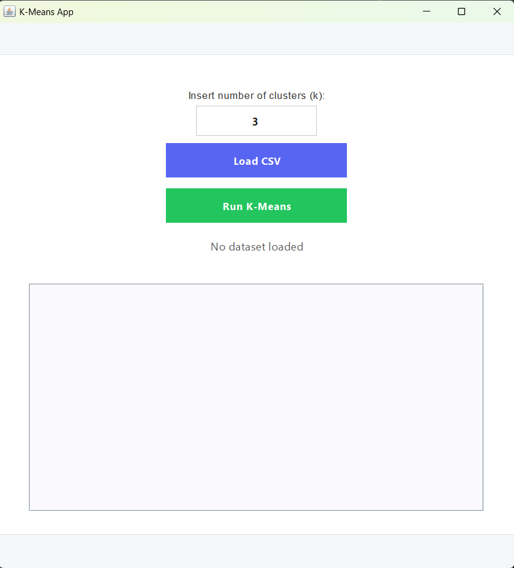
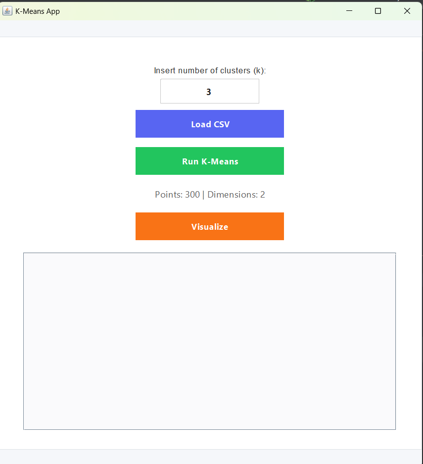
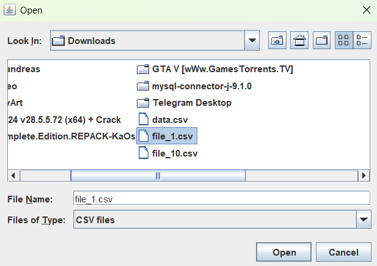
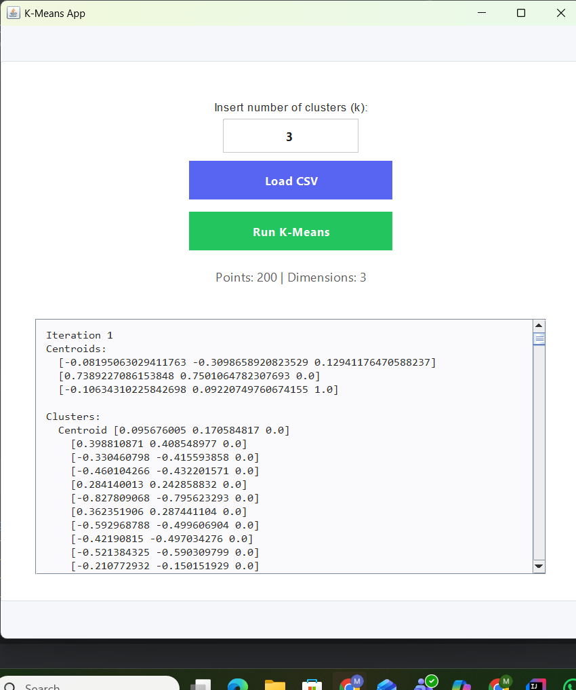
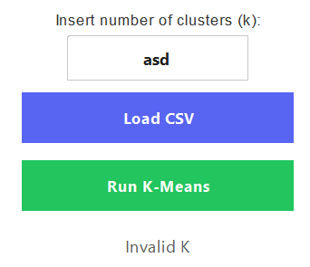
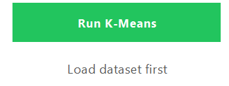
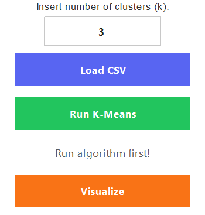

# Clojure K-Means implementation

## Overview

This project is an implementation of the K-Means clustering algorithm written in Clojure.
The application allows users to:
- Load datasets from CSV files
- Run the K-Means clustering algorithm
- Visualize clustering iterations in real time
- Navigate through algorithm steps manually
- Observe centroid movement and cluster formation

The primary goal of the project is to demonstrate the logic behind the K-Means algorithm and functional-style implementation in Clojure.

## About K-Means Clustering

K-Means is an unsupervised machine learning algorithm used for grouping data points into clusters based on similarity.

The algorithm partitions a dataset into k clusters, where each cluster is represented by its centroid (center point).

The process is iterative and consists of the following steps:

1. Initialize centroids
2. Assign each point to the nearest centroid
3. Recalculate centroid positions
4. Repeat from step 2 until convergence

The algorithm attempts to minimize the distance between points and their assigned centroids.

## Application interface overview

Interface looks like simple java swing form:

Form consists of the following elements:

- K input field -> input the number of wanted clusters;
- Load CSV buton -> enables user to load csv file from local machine;
- Run K-Means -> runs the algorithm on the loaded dataset;
- Message label -> writes messages for user to make it easier to understand if something's happening or there is some issue;
- Text area -> outputs details of the algorithm run;
- Hidden "Visualize" button -> shown only when 2d dataset is loaded. Displays animation of the algorithm and enables user to move through each iteration of K-Means. Complete form with hidden button will be shown in image below.

## Application Workflow

When user runs app, the form shows up:

In the input field user chooses the number of centroids they want. In this example I will keep 3. This data can be modified at any moment.

In order to run the algorithm, user needs to click "Load CSV" button to load data. Clicking the buttons opens swing-style window that enables them to select file from their local machine:

Since loaded data is 2-dimensional, the "Visulaize" button shows up. The label informs user that 300 points are loaded, and that data is 2d.

By clicking "Run K-Means" button, the algorithm is run and details are displayed in text area.

User can now use visualize button as well to see the animation of the algo run. By using arrow keys, user can also navigate through each step of the animation, which makes it easier to follow what happens.

Example of animation and navigation through steps:

If the data is n-dimensional, where n is whole number and n > 2, algorithm details will be displayed, but visualization will be disabled.

Example of 3d case:

### Edge cases

1. User uses invalid data in input field:

2. User tries to run algorithm before loading anything:

3. User tries to load non-csv type of file -> this edge case is covered in way that explorer won't display anything but csv files for user.

4. User tries to visualize data before running the algorithm:

## Development

